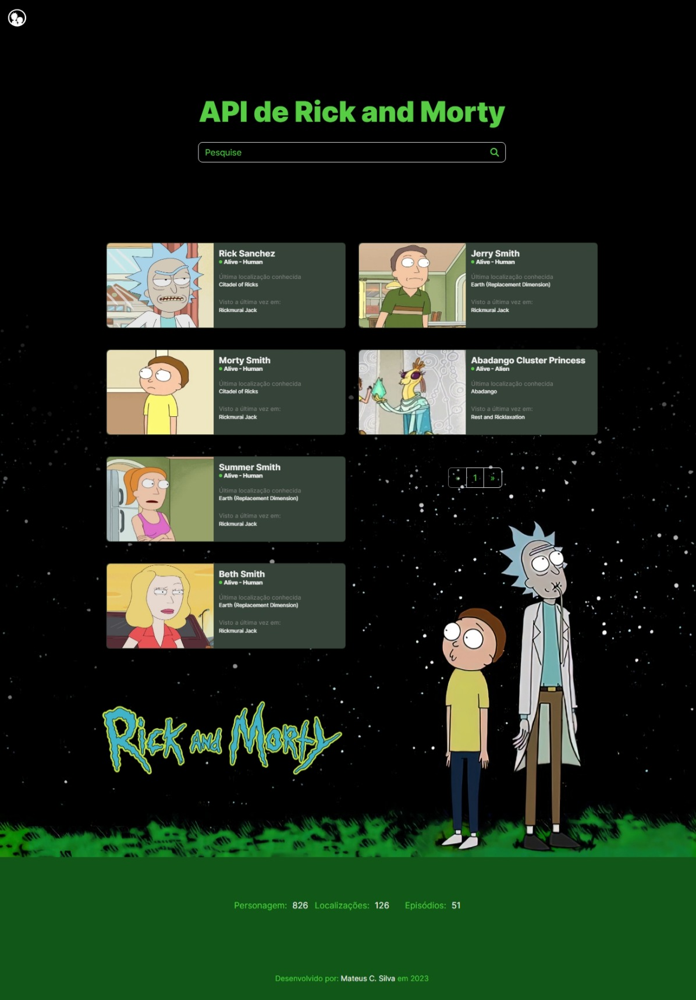

# Projeto de Atividade Final - Módulo III de Front End Growdev

Este é o projeto final do Módulo III de Front End da Growdev. O projeto consiste em uma aplicação web que exibe informações sobre personagens da série de TV "Rick and Morty". Utiliza-se a API pública do Rick and Morty para obter os dados dos personagens, episódios e localizações.

## Funcionalidades

- Exibição de personagens em cards com informações básicas.
- Paginação para navegar pelos diferentes conjuntos de personagens.
- Modal de detalhes para cada personagem, exibindo informações como nome, status, espécie, última localização conhecida e último episódio visto.
- Contagem total de personagens, localizações e episódios.
- Animação de entrada dos cards para uma experiência mais dinâmica.

## Como Usar

1. Clone o repositório para sua máquina local.
2. Abra o arquivo `index.html` em um navegador da web compatível.
3. Explore os personagens, navegue pelas páginas e clique nos cards para ver mais detalhes.

## Tecnologias Utilizadas

- HTML5
- CSS3 (incluindo Flexbox e Grid para layout responsivo)
- JavaScript (incluindo Fetch API para comunicação com a API)
- Bootstrap (para estilos e modais)
- Axios (para requisições HTTP mais simplificadas)

## Autor

Este projeto foi desenvolvido por Mateus C. da Silva.
